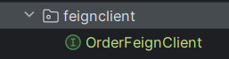
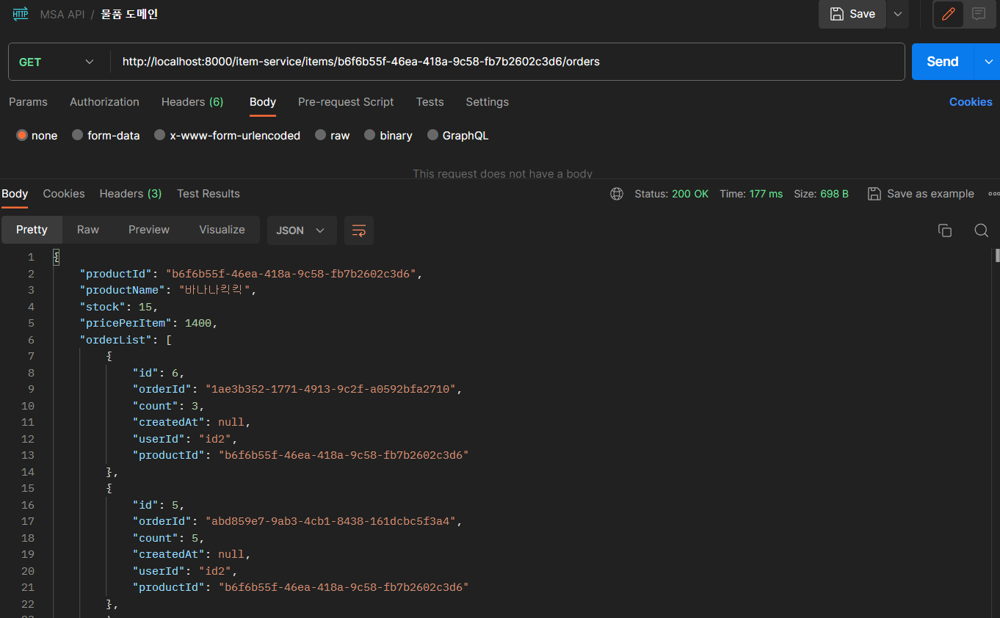

# 🎆 MSA 개별 서비스간 통신

MSA 개별 서비스간 통신하기 위한 방법으로,

- feign
- resttemplate

이 있다.

이 중 feign client를 이용한 개별 서비스간의 통신을 실습 해보자.

## 🎇 Feign 클라이언트

`Feign Client`  : 외부에서 데이터를 가져오려는 서버.

`DataBase` : 필요한 데이터가 있는 서버.

##### 세팅

현재 gateway-server, discovery-server는 실행 중이다.

세팅 순서는 apigateway 서버에 각 서비스 서버를 등록했다는 가정 하에 진행.

Feign Client = 'item-service'

DataBase = 'order-service'

아이템 별로 주문내역을 조회


##### 실습 시작

DataBase에서 데이터를 가져오기 위한 쿼리메서드를 정의해준다.

###### OrderRepository

```
Optional<List<Order>> findOrderByProductIdOrderByIdDesc(String productId);
```

jpa repository를 사용하여 목록 조회를 위한 service를 정의한다.

###### OrderService

```
public Optional<List<Order>> getOrderListByProductId(String productId){
        return orderRepository.findOrderByProductIdOrderByIdDesc(productId);
    }
```

###### OrderController

```
@GetMapping("orders/items/{productId}")
    public ResponseEntity<?> getOrdersFeignByProductId(@PathVariable String productId){
        List<Order> orders = orderService.getOrderListByProductId(productId)
                .orElseThrow(() -> new RuntimeException("주문된 상품 내역이 없습니다."));

        return ResponseEntity.status(200).body(orders);
    }
```

위의 코드들은 상품번호로 조회된 주문내역 목록을 **"orders/items/{productId}"** 라는 url을 통해 `feign client` 측으로 전달하기 위한 코드이다.


이제 `feign client` 측 코드를 추가해보자.

우선, ItemServiceApplication 에 @EnableFignClients를 추가해준다.

###### ItemServiceApplication

```
@EnableFeignClients
public class ItemServiceApplication {

    public static void main(String[] args) {
        SpringApplication.run(ItemServiceApplication.class, args);
    }

}
```


그 다음, feign을 하기 위해 feign clinet 라는 패키지를 생성한 뒤 OrderFeignClient 인터페이스를 추가해준 뒤, OrderFeignClient 내 feign을 위한 메서드를 정의해준다.




###### OrderFeignClient

```
import com.playdata.itemservice.domain.Order;
import org.springframework.cloud.openfeign.FeignClient;
import org.springframework.web.bind.annotation.GetMapping;
import org.springframework.web.bind.annotation.PathVariable;

import java.util.List;

@FeignClient(name="ORDER-SERVICE", path="order-service")
public interface OrderFeignClient {

    @GetMapping("orders/items/{productId}")
    List<Order> getOrdersFeignByProductId(@PathVariable String productId);
}

```


- @FeignClient() : 서버 간의 통신을 위해 "디스커버리 서버" 내 정의된 서비스명과 경로로 설정해준다.
- @GetMapping() : 해당 서버 내 데이터 목록을 반환하는 Controller에 정의된 URL를 명시해준다.

feign 요청을 위해 메서드를 아래의 구조로 작성해줘야 한다.

```
@FeignClient(name = "eureka에 등록한 서비스명")
public interface 인터페이스명 {
    @GetMapping("/엔드포인트패턴/{pathvariable이 있다면...}")
    리턴자료형 메서드명(@PathVariable("pathvariable명") 자료형 변수명);
}
```


feign하여 가져온 Order 목록을 받을 List \<Order> 를 갖는 ResponseFeignItemDto를 정의한다.


###### ResponseFeignItemDto

```
import com.playdata.itemservice.domain.Item;
import com.playdata.itemservice.domain.Order;
import lombok.*;

import java.util.List;

@Getter
@Setter
@Builder
@NoArgsConstructor
@AllArgsConstructor
public class ResponseFeignItemDto {

    private String productId;
    private String productName;
    private Long stock;
    private Long pricePerItem;
    private List<Order> orderList;

    public ResponseFeignItemDto(Item item){
        productId = item.getProductId();
        productName = item.getProductName();
        stock = item.getStock();
        pricePerItem = item.getPricePerItem();
    }
}
```


추가로, Order 클래스는 item-service 서버 내 정의되지 않은 객체이므로, Order를 생성해준다.

Order 클래스는 order-service에서 데이터를 받아오기 위한 목적이므로 order-service에서 가져올

Order 테이블 내 컬럼들을 필드로 정의한다.

###### Order - item-service

```
import lombok.Getter;
import lombok.Setter;
import lombok.ToString;

import java.time.LocalDateTime;

@Getter @Setter @ToString
public class Order {
    private Long id;

    private String orderId;

    private Long count;

    private LocalDateTime createdAt;

    private String userId;

    private String productId;
}
```


feign 인터페이스의 구현체를 사용하기 위해 Service에 기능을 추가해준다.

###### ItemService

```
public ResponseFeignItemDto findItemOrderList(String productId){

        Item item = itemRepository.findByProductId(productId);
        ResponseFeignItemDto dto = new ResponseFeignItemDto(item);
        dto.setOrderList(feignClient.getOrdersFeignByProductId(productId));
        return dto;

    }
```


이후 Controller에서 해당 Service로 반환한 ResponseFeignItemDto 객체를 반환하도록 구현한다.

###### ItemController

```
@GetMapping("items/{productId}/orders")
    public ResponseEntity<?> findOrderListByProductId(@PathVariable String productId){
        ResponseFeignItemDto item = itemService.findItemOrderList(productId);
        return ResponseEntity.status(200).body(item);
    }
```


포스트맨에서 요청 테스트를 해보자


아래와 같이 item-service에 GET 요청을 보냈다.


정상 결과가 나오는 것을 확인할 수 있다.




## 🎇 결론

Fein Client 를 사용하여 MSA 개별 서비스 간에 통신으로 데이터를 가져와 보았다.

MSA 구조에서는 Server가 물리적으로 나눠져 있기 때문에 JOIN이 불가능하다.

따라서, 서버 간 통신을 통해 데이터를 주고 받아야 하기 때문에 Feign Client를 사용한 것이다.
